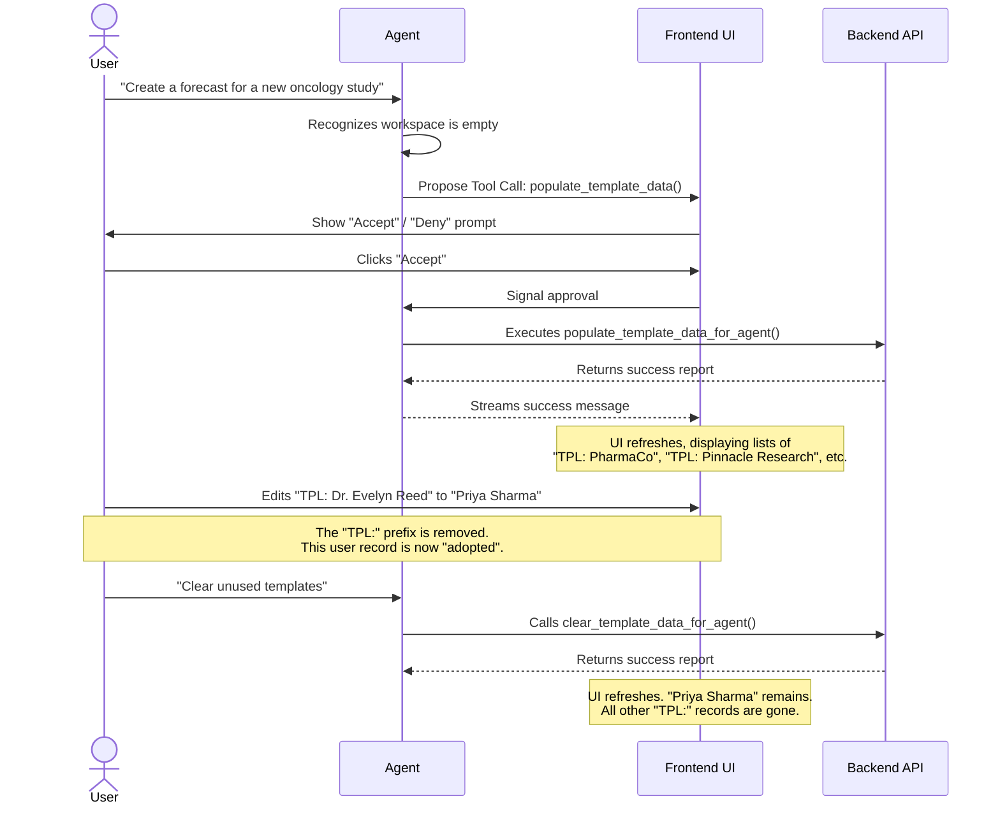
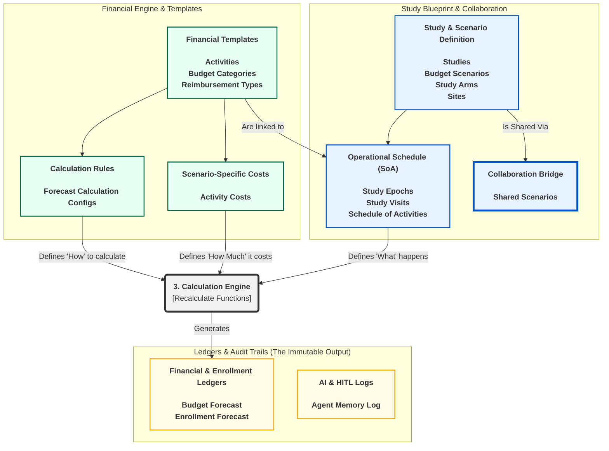

# CTFBio AI: The IDE for Clinical Trials

Welcome to the public beta of **CTFBio AI**, a strategic planning engine designed to revolutionize clinical trial forecasting and financial management.

This repository is the central hub for our beta community. We're thrilled to have you on board and look forward to your feedback as we build the future of clinical trial planning together.

## Table of Contents

1.  [What is CTFBio AI?](#1-what-is-ctfbio-ai)
2.  [Key Features](#2-key-features)
3.  [Getting Started: Your First Forecast](#3-getting-started-your-first-forecast)
    *   [Option A: The Quick Start (Using Template Data)](#option-a-the-quick-start-using-template-data)
    *   [Option B: The Guided Path (Building from Scratch)](#option-b-the-guided-path-building-from-scratch)
4.  [Core Concept: The IDE for Clinical Trials](#4-core-concept-the-ide-for-clinical-trials)
5.  [Under the Hood: The Calculation Engines](#5-under-the-hood-the-calculation-engines)
6.  [System Architecture & Data Flow](#6-system-architecture--data-flow)
7.  [Providing Feedback](#7-providing-feedback)
8.  [Technology Stack](#8-technology-stack)

## 1. What is CTFBio AI?

Clinical trial planning is plagued by disconnected spreadsheets, opaque financial models, and an inability to react quickly to operational changes. This leads to budget overruns, delayed timelines, and poor strategic decisions.

**Our solution is an Integrated Development Environment (IDE) for Clinical Trials.**

Like a software IDE that helps developers write, compile, and debug code, CTFBio provides a powerful, AI-native environment to help you design, calculate, and analyze clinical trial plans with unprecedented speed and accuracy.

## 2. Key Features

*   **🤖 Real-time AI Assistance:** An intelligent agent helps you build plans, suggest costs, and answer complex analytical questions in plain English.
*   **⚙️ Powerful Forecasting Engine:** A robust "compiler" transforms your high-level study blueprint into a detailed, time-phased financial and operational ledger.
*   **🔬 Sophisticated Scenario Modeling:** Safely "branch" any forecast to model "what-if" scenarios (e.g., faster enrollment, protocol amendments) and perform powerful variance analysis without corrupting your baseline plan.
*   **📊 Interactive Data Management:** A full suite of tools to manage every component of your trial, from organizations and sites to activities and costs.
*   **🔒 Safe & Secure:** Built on a multi-tenant architecture that guarantees your data is isolated and secure.

## 3. Getting Started: Your First Forecast

After signing up and creating your organization, you have two paths to create your first forecast.

### Option A: The Quick Start (Using Template Data)

The fastest way to see the power of CTFBio is to load our pre-built, analysis-ready template data. This workflow is seamlessly integrated with the AI Agent and the UI.

1.  **Open the Modal:** From the **Global Tools** menu, select **"Populate Template Data"**.
2.  **Pre-Flight Check:** The system performs a pre-flight check of your sandbox.
    *   If your sandbox is empty, you can proceed to step 4.
    *   If template data is detected, the "Populate" buttons will be disabled. You must first choose one of the following actions:
        *   **"Clear Unused Templates"**: Safely removes all template data you haven't adopted.
        *   **"Adopt All Templates"**: Converts all template data into your own permanent records.
3.  **Choose Your Data:**
    *   Click **"Populate All Templates"** to load the entire portfolio.
    *   Or, select specific studies from the list and click **"Populate Selected"**.
4.  **Explore and Adopt:**
    *   Template records are starting points, identified by a `TPL-` prefix.
    *   To make one your own, simply **edit it**. An **"Adopt"** button will appear. Clicking it converts the template into your own permanent, editable record.

This entire workflow is designed to be safe and intuitive.



### Option B: The Guided Path (Building from Scratch)

Follow this logical data flow to build a complete, accurate forecast from the ground up. The platform is designed to guide you through these phases in order.

```mermaid
graph TD
    subgraph "Phase 1: Foundational Setup"
        A[1. Organizations & Users] --> B;
        B[2. Budget Categories & Reimbursement Types] --> C;
        C[3. Activity Templates] --> D;
    end

    subgraph "Phase 2: Blueprint Configuration"
        D[4. Studies & Scenarios] --> E;
        E[5. Link Study to Scenario (Create Configuration)] --> F;
        F[6. Define Partners, Sites, & Calculation Rules] --> G;
        G[7. Define Schedule (Arms, Epochs, Visits)] --> H;
    end
    
    subgraph "Phase 3: Financial & Operational Setup"
        H[8. Assign Costs to Activities] --> I;
        I[9. Map Activities to Visits (Build SoA)] --> J;
    end

    subgraph "Phase 4: Calculation & Analysis"
        J[10. Recalculate Enrollment] --> K;
        K[11. Recalculate Forecast] --> L;
        L[12. Analyze & Compare Scenarios];
    end
```

## 4. Core Concept: The IDE for Clinical Trials

Understanding our core product metaphor will help you get the most out of the platform.

*   **You Write the "Code" (The Blueprint):** The collection of setup tables (like Studies, Arms, Visits, Activities, and Costs) represents the high-level, human-readable source code of your clinical trial plan.
*   **CTFBio "Compiles" It (The Calculation):** The calculation engines transform your blueprint into low-level, machine-readable "bytecode"—the `Budget Forecast` table. This is the ultimate operational and financial ledger of your trial.
*   **You "Debug" It (The Analysis):** Our dashboards and analysis tools allow you to inspect the compiled output. The system provides:
    *   **Compiler Errors:** Structural errors that prevent a forecast from running.
    *   **Compiler Warnings:** Data gaps (like a missing cost) that lead to an incomplete forecast.
    *   **Profiler Output:** High-level analytics to help you judge if the plan is sound.
*   **You Use "Version Control" (Scenario Cloning):** The `clone_budget_scenario` function enables safe, isolated "branching" for what-if analysis without corrupting your "main" branch (the Baseline).

## 5. Under the Hood: The Calculation Engines

The "compiler" is the heart of the platform. It runs in two stages, which you can trigger from the **Global Tools -> Calculation Engines** menu.

### Stage 1: Recalculate Enrollment

*   **What it Does:** Takes the high-level enrollment targets and dates for each site and generates a detailed, month-by-month projection of new subject enrollment.
*   **How You Control It:** The output is driven by the data you enter in the **Sites** table, specifically the `Target Enrollment`, `Activation Date`, and `Closeout Date`. You can also assign sites to "Performance Groups" (enrollment curves defined in **Forecast Configs**) for more complex, non-linear enrollment patterns.

### Stage 2: Recalculate Forecast

*   **What it Does:** This is the main compiler. It takes the entire study blueprint (schedule, activities, costs) and the newly calculated enrollment projections to generate the final, line-item-level budget forecast.
*   **How You Control It:** The output is a direct result of your blueprint. The most influential tables are:
    *   **Study Arms:** The `Target Enrollment` for each arm controls the **enrollment weight**, ensuring your forecast accurately reflects imbalanced trial designs.
    *   **Schedule of Activities:** This is the primary trigger. An activity must be mapped to a visit here to be included in the schedule-based forecast.
    *   **Activity Costs:** This is your price list. If an activity is missing a cost, the engine creates a **zero-cost record**, giving you a complete operational ledger, not just a financial one.

### Your Manual Edits Are Safe!

Both engines are designed to be run multiple times as you refine your plan. They are built to be safe and respect your manual work. When you edit a row in a forecast table, it's flagged as a `'USER_EDIT'`. The calculation engines are architecturally forbidden from touching these records, so you can recalculate with confidence, knowing your manual overrides will be preserved.

## 6. System Architecture & Data Flow

This diagram provides a high-level overview of how the major components of the system interact to transform your blueprint into an actionable forecast.



## 7. Providing Feedback

Your feedback is the most valuable part of this beta. Please help us improve by reporting bugs and suggesting features.

**Please use the [Issues tab](https://github.com/ctfbio-ai/ctfbio-ai/issues) in this repository.**

When reporting a bug, please include:
*   A clear and descriptive title.
*   A description of what happened.
*   What you expected to happen.
*   Steps to reproduce the issue.
*   Any relevant screenshots or error messages.
